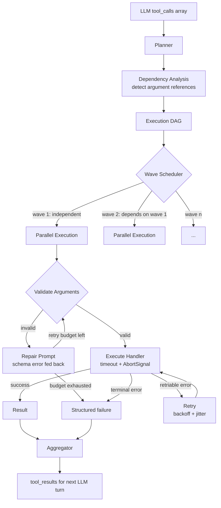
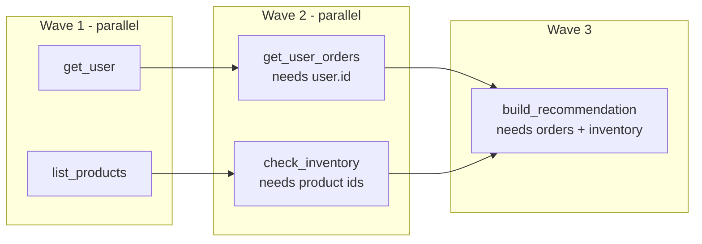

# function-calling-engine

> Robust LLM tool-use orchestration: JSON Schema validation, dependency-aware parallel execution, retry policies with repair prompting, timeout and cancellation propagation, and result aggregation.

[](https://www.typescriptlang.org/)
[](https://nodejs.org/)
[](LICENSE)
[](#project-status)

## Project Status

**Work in progress.** The execution planner, dependency resolver, validation and repair loop, and cancellation propagation are implemented. Provider adapters for tool-call formats are in development.

## Problem

LLM function calling looks simple until it runs in production. The failure modes are consistent across every provider:

- **Arguments are wrong, not absent.** The model returns `{"limit": "20"}` when the schema says number, or invents a field, or omits a required one. Naive code either crashes or silently coerces garbage.
- **Parallel calls have hidden dependencies.** The model requests `get_user` and `get_user_orders` together, but the second needs the first's output. Running them in parallel produces a call with a placeholder id.
- **One slow tool blocks everything.** No per-tool timeout means a hung HTTP request stalls the whole turn.
- **Retries make things worse.** Retrying a failed `create_invoice` without idempotency creates two invoices.
- **Errors reach the model as noise.** A raw stack trace tells the model nothing actionable, so it retries the same wrong call.

This engine sits between the model's tool-call output and your actual functions, and handles each of those.

## Execution Model



### Wave Scheduling

The model emits a flat array of tool calls. The planner builds a DAG from it and executes in waves: everything with no unmet dependencies runs in parallel, then the next layer, and so on.



This is strictly better than both alternatives. Full parallelism breaks on dependencies. Full serialization wastes time on calls that are genuinely independent.

Dependencies are detected two ways: explicit references in arguments (a `$ref` style pointer to another call's output) and declared dependencies in the tool definition. The engine does **not** guess dependencies from argument name similarity, because guessing wrong produces silent ordering bugs that are extremely hard to debug.

### Validation and Repair

When arguments fail schema validation, the engine does not simply retry. It constructs a repair prompt containing the specific validation errors with field paths, and asks the model to correct that single call:

```
Tool: search_contacts
Your arguments failed validation:
  - limit: expected number, received string "20"
  - includeArchvied: unrecognized key (did you mean "includeArchived"?)
Schema: { query: string, limit: number (1-100), includeArchived: boolean }
Return corrected arguments only.
```

Typo suggestions come from Levenshtein distance against known schema keys. This matters because "unrecognized key" alone often causes the model to drop the field rather than fix the spelling.

Repair attempts are budgeted separately from execution retries, because they fail for different reasons and a shared budget lets one starve the other.

### Retry Classification

Not all failures should be retried. The engine classifies before deciding:

| Class | Examples | Behaviour |
|-------|----------|-----------|
| **Transient** | Network timeout, 502, 503, connection reset | Retry with exponential backoff + jitter |
| **Rate limited** | 429 with `Retry-After` | Retry, honouring the server's stated delay |
| **Terminal** | 400, 404, validation failure, business rule rejection | Do not retry, return structured error to the model |
| **Unsafe to retry** | Non-idempotent tool that may have partially applied | Do not retry, surface explicitly |

A tool marked `idempotent: false` is never automatically retried after a timeout, because a timeout means *unknown outcome*, not *failed*. Retrying a create operation whose result is unknown is how duplicate records happen.

### Cancellation Propagation

Every handler receives an `AbortSignal`. When the overall turn deadline passes, or the caller aborts, or a sibling call fails in `failFast` mode, the signal fires and in-flight work can stop. Handlers that ignore the signal are still cut off at the timeout boundary, but they waste the resources until they finish.

## Installation

```bash
npm install @q1-digital/function-calling-engine
```

## Quick Start

```typescript
import { FunctionCallingEngine, defineFunction } from '@q1-digital/function-calling-engine';
import { z } from 'zod';

const engine = new FunctionCallingEngine({
  execution: {
    mode: 'wave',              // 'wave' | 'parallel' | 'serial'
    maxConcurrency: 8,
    turnTimeoutMs: 30_000,
    failFast: false,           // Continue sibling calls when one fails
  },
  validation: {
    maxRepairAttempts: 2,
    suggestTypos: true,
  },
  retry: {
    maxAttempts: 3,
    baseDelayMs: 500,
    maxDelayMs: 8_000,
    jitter: true,
  },
});

engine.register(defineFunction({
  name: 'get_user',
  description: 'Fetch a user record by id.',
  input: z.object({
    userId: z.string().uuid(),
  }),
  idempotent: true,
  timeoutMs: 3_000,
  handler: async ({ userId }, ctx) => {
    const user = await db.users.findById(userId, { signal: ctx.signal });
    if (!user) {
      // Terminal by design: retrying will not make the user exist
      throw ctx.terminalError('USER_NOT_FOUND', `No user with id ${userId}`);
    }
    return user;
  },
}));

engine.register(defineFunction({
  name: 'create_invoice',
  description: 'Create an invoice for a user.',
  input: z.object({
    userId: z.string().uuid(),
    amountCents: z.number().int().positive(),
  }),
  idempotent: false,           // Never auto-retried after an unknown outcome
  timeoutMs: 10_000,
  handler: async (args, ctx) => billing.createInvoice(args, { signal: ctx.signal }),
}));

// Feed the model's raw tool_calls array straight in
const results = await engine.execute(llmResponse.tool_calls, {
  repair: async (repairPrompt) => {
    const corrected = await llm.complete({ messages: [{ role: 'user', content: repairPrompt }] });
    return corrected.content;
  },
});

for (const r of results.calls) {
  if (r.ok) {
    console.log(r.name, r.result, `${r.latencyMs}ms`, `wave ${r.wave}`);
  } else {
    console.warn(r.name, r.error.code, r.error.message, `attempts: ${r.attempts}`);
  }
}

// Ready to append to the conversation for the next turn
console.log(results.toolMessages);

console.log(results.summary);
// { total, succeeded, failed, waves, totalLatencyMs, repairsUsed }
```

### Declaring Dependencies Explicitly

```typescript
engine.register(defineFunction({
  name: 'get_user_orders',
  description: 'List orders for a user.',
  input: z.object({ userId: z.string().uuid() }),
  dependsOn: ['get_user'],   // Scheduled in a later wave than get_user
  handler: async ({ userId }, ctx) => db.orders.byUser(userId, { signal: ctx.signal }),
}));
```

### Referencing Another Call's Output

The model can emit a reference instead of a literal, and the planner resolves it after the producing call completes:

```json
{
  "name": "get_user_orders",
  "arguments": { "userId": { "$fromCall": "call_1", "path": "id" } }
}
```

### Handling Partial Failure

```typescript
if (results.summary.failed > 0 && results.summary.succeeded > 0) {
  // Partial success is the common case and must be representable.
  // The model gets successful results plus structured errors for the rest,
  // so it can decide whether to retry, work around, or ask the user.
}
```

## Configuration

```typescript
interface EngineConfig {
  execution: {
    mode: 'wave' | 'parallel' | 'serial';
    maxConcurrency: number;
    turnTimeoutMs: number;
    failFast: boolean;
  };
  validation: {
    maxRepairAttempts: number;
    suggestTypos: boolean;
    coerceTypes?: boolean;      // Attempt "20" -> 20 before repairing
  };
  retry: {
    maxAttempts: number;
    baseDelayMs: number;
    maxDelayMs: number;
    jitter: boolean;
  };
}

interface FunctionDefinition<TSchema extends z.ZodTypeAny> {
  name: string;
  description: string;
  input: TSchema;
  handler: (args: z.infer<TSchema>, ctx: CallContext) => Promise<unknown>;
  idempotent?: boolean;         // Default false: safety over convenience
  timeoutMs?: number;
  dependsOn?: string[];
  maxAttempts?: number;         // Per-tool override
}
```

## Project Structure

```
src/
├── core/
│   ├── engine.ts                  # Public API: register, execute
│   ├── registry.ts                # Function definitions + schema derivation
│   └── context.ts                 # CallContext, AbortSignal, error factories
├── planning/
│   ├── planner.ts                 # tool_calls -> execution plan
│   ├── dependency-resolver.ts     # DAG construction + cycle detection
│   └── wave-scheduler.ts          # Topological layering
├── validation/
│   ├── validator.ts               # Zod validation + error shaping
│   ├── repair-prompt.ts           # Builds corrective prompts
│   ├── typo-suggester.ts          # Levenshtein against schema keys
│   └── coercion.ts                # Safe type coercion
├── execution/
│   ├── executor.ts                # Handler invocation + timeout
│   ├── concurrency.ts             # Bounded parallelism
│   └── cancellation.ts            # AbortSignal propagation
├── resilience/
│   ├── error-classifier.ts        # Transient / rate-limited / terminal
│   ├── retry.ts                   # Backoff with full jitter
│   └── idempotency.ts             # Retry safety enforcement
├── aggregation/
│   ├── aggregator.ts              # Result collection
│   └── tool-message-builder.ts    # Provider-shaped tool results
└── index.ts
```

## Design Decisions

**Why default `idempotent: false`?** Because the cost of being wrong is asymmetric. Failing to retry a safe operation costs one extra model turn. Retrying an unsafe one costs a duplicate invoice. Safe defaults belong on the side where mistakes are cheap.

**Why feed validation errors back instead of just retrying?** An identical retry produces an identical failure, since the model has no new information. The specific field path and expected type is exactly the information needed to fix it, and models correct reliably when given it.

**Why separate repair budget from retry budget?** They fail for unrelated reasons. Argument malformation is a model problem; a 503 is an infrastructure problem. Sharing a budget means a flaky API can consume all the attempts that argument repair needed.

**Why refuse to infer dependencies from argument names?** Because `userId` in two calls might be the same user or two different ones, and guessing wrong silently reorders execution. Wrong ordering produces plausible-looking incorrect results, which is the worst class of bug. Explicit declaration or explicit reference only.

**Why full jitter on backoff?** Without jitter, all concurrent retries fire simultaneously after the same delay, recreating the load spike that caused the failure. Full jitter (`random(0, delay)`) spreads them out and is what AWS's own guidance recommends.

**Why waves instead of a general work-stealing scheduler?** Tool calls in a single turn number in the tens, not thousands. Wave scheduling is trivially explainable, deterministic, and easy to trace in logs. A cleverer scheduler would add complexity with no measurable benefit at this scale.

## Roadmap

- [ ] Provider adapters for tool-call formats (OpenAI, Anthropic, Gemini)
- [ ] Speculative execution of likely next calls
- [ ] Result caching for idempotent calls within a turn
- [ ] Streaming partial results as waves complete
- [ ] Distributed execution across workers
- [ ] Trace export in OpenTelemetry format

## License

MIT
